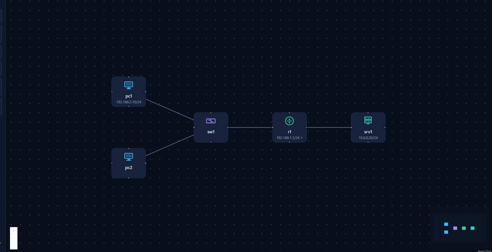
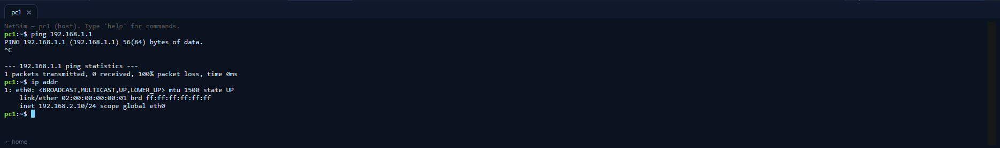
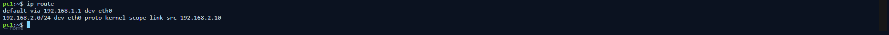
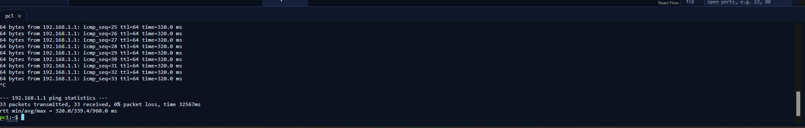

# Ticket 01 — Incorrect IP Configuration

## Scenario

**Environment:** Simulated IT support lab using NetSim  
**Ticket type:** Network connectivity / workstation support  
**Status:** Resolved

### User Report

> A user reports that their workstation appears to be connected to the network, but it cannot reach network resources.

This scenario simulates a workstation that has been assigned an incorrect static IPv4 address. The physical connection remains active, but the host is configured for the wrong subnet.

## Network Environment

| Device | Address | Role |
|---|---|---|
| PC1 | `192.168.1.10/24` (intended) | User workstation |
| R1 | `192.168.1.1/24` | Default gateway |
| SRV1 | `10.0.0.20/24` | Server |

During the simulated incident, PC1 was incorrectly configured as `192.168.2.10/24` while its default gateway remained `192.168.1.1`.



## Troubleshooting

### 1. Test connectivity to the default gateway

I first tested whether PC1 could reach its configured gateway:

```bash
ping 192.168.1.1
```

The test returned **100% packet loss**, confirming that PC1 could not reach the gateway. A failed ping identifies a connectivity problem, but by itself does not identify the root cause.

### 2. Inspect the workstation IP configuration

I checked the network interface configuration with:

```bash
ip addr
```

The interface was `UP`, but PC1 had the address:

```text
192.168.2.10/24
```

The failed ping and incorrect workstation address are shown below.



### 3. Inspect the routing table

I then checked PC1's routes:

```bash
ip route
```

The output showed:

```text
default via 192.168.1.1 dev eth0
192.168.2.0/24 dev eth0
```



This confirmed the configuration mismatch. PC1 considered `192.168.2.0/24` its directly connected network, while its configured gateway was `192.168.1.1` on the `192.168.1.0/24` network.

## Root Cause

PC1 had an incorrect static IPv4 address:

```text
Incorrect: 192.168.2.10/24
Expected:  192.168.1.10/24
Gateway:   192.168.1.1
```

With a `/24` prefix, `192.168.2.10` and `192.168.1.1` belong to different subnets. The workstation therefore could not communicate normally with its configured gateway.

## Resolution

I corrected PC1's IPv4 address from:

```text
192.168.2.10/24
```

to:

```text
192.168.1.10/24
```

No other configuration was changed.

## Verification

After correcting the address, I verified connectivity again:

```bash
ping 192.168.1.1
```

PC1 successfully received ICMP replies from the gateway with **0% packet loss**.



## Commands Used

| Command | Purpose |
|---|---|
| `ping 192.168.1.1` | Test reachability to the default gateway |
| `ip addr` | Inspect interface state and IPv4 addressing |
| `ip route` | Inspect the routing table and configured default gateway |

## Key Takeaways

- An active network interface does not guarantee correct Layer 3 connectivity.
- A failed `ping` confirms a reachability problem but does not identify the cause by itself.
- `ip addr` and `ip route` can quickly reveal addressing and gateway inconsistencies.
- After making a change, always verify that the original symptom is resolved.

---

*This ticket is a simulated troubleshooting exercise completed in NetSim for IT support practice and portfolio documentation.*
