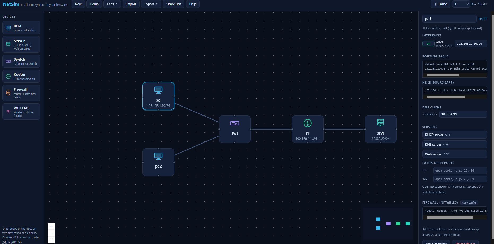

# Ticket 002 — DNS Name Resolution Failure

## Scenario

**Lab type:** Simulated IT support ticket  
**Environment:** NetSim browser-based network simulator  
**Status:** Resolved

### User Report

> "My computer is connected to the network, but I can't access the company website at `web.lan`."

The workstation (`pc1`) had valid IP connectivity, but the internal hostname could not be resolved. The goal was to determine whether the failure was caused by basic network connectivity or by name resolution.

## Network Environment

| Device | Address / Role |
|---|---|
| `pc1` | `192.168.1.10/24` — client workstation |
| `r1` | `192.168.1.1/24` — default gateway for the client network |
| `srv1` | `10.0.0.20/24` — DNS and web server |
| Internal hostname | `web.lan` → `10.0.0.20` |

## Troubleshooting

### 1. Test direct connectivity to the server

I first tested whether the workstation could reach the server by IP address:

```bash
ping 10.0.0.20
```

The server responded successfully. This showed that the workstation had network connectivity to `srv1`, so the issue was not simply a loss of connectivity between the client and server.


### 2. Test connectivity by hostname

I then tested the same server using its hostname:

```bash
ping web.lan
```

The command returned a **temporary failure in name resolution**. Because the server was reachable by IP but not by hostname, DNS/name resolution became the primary suspect.


### 3. Query DNS directly

To test DNS resolution directly, I used:

```bash
dig web.lan
```

The query timed out and reported that no DNS servers could be reached.


### 4. Inspect the client's DNS configuration

NetSim's client configuration showed that `pc1` was configured to use:

```text
10.0.0.99
```

However, the DNS service for this lab was hosted on `srv1` at:

```text
10.0.0.20
```



## Root Cause

The workstation was configured with an **incorrect DNS server address (`10.0.0.99`)**. Basic IP connectivity to the actual server was working, but DNS queries were being sent to the wrong address, preventing `web.lan` from being translated to `10.0.0.20`.

## Resolution

I changed the DNS client configuration on `pc1` from:

```text
10.0.0.99
```

to the correct DNS server:

```text
10.0.0.20
```

No other network settings were changed.

## Verification

I repeated the DNS query:

```bash
dig web.lan
```

The query returned `NOERROR` and an A record mapping `web.lan` to `10.0.0.20`.


Finally, I tested the hostname again:

```bash
ping web.lan
```

The hostname resolved to `10.0.0.20` and the server responded successfully.


## What I Learned

- A successful ping to an IP address does not prove that DNS is working.
- Comparing **IP connectivity** with **hostname connectivity** helps isolate name-resolution problems.
- `dig` can be used to test DNS resolution directly and identify DNS-server communication failures.
- Troubleshooting should isolate the failing component before changing configuration.
- After applying a fix, both the affected service and the original user symptom should be tested again.

> **Note:** This ticket was created and completed in a simulated environment for hands-on IT support practice. NetSim implements a limited subset of Linux networking commands, so its behavior and available utilities do not exactly match a full Linux system.
