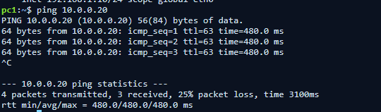
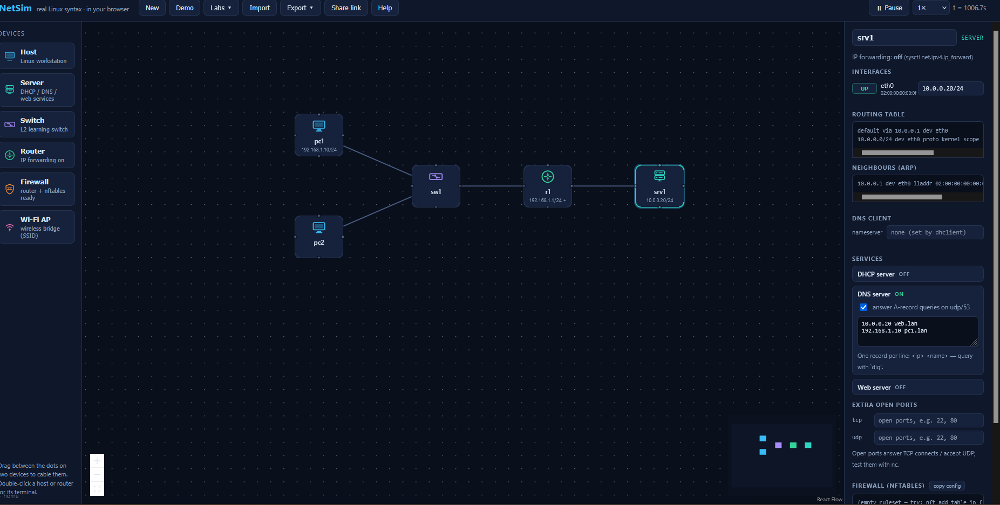
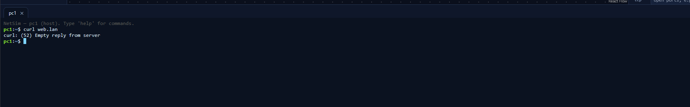
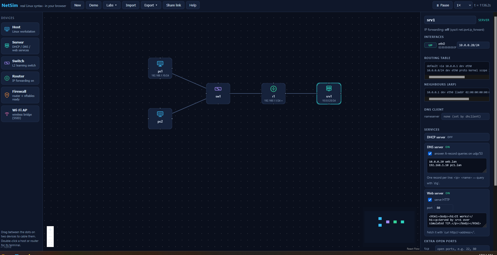
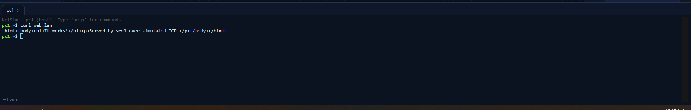

# Ticket 03 — Web Service Unavailable

**Ticket:** INC-003  
**Priority:** Medium  
**Status:** Resolved  
**Lab:** NetSim (simulated IT support environment)

## Scenario

A user reported that the company website would not load even though the workstation still appeared to be connected to the network. The goal was to determine whether the failure was caused by the workstation, DNS, network connectivity, or the web service itself.

> This is a simulated support scenario created for hands-on troubleshooting practice. It is not a real customer incident.

## User Report

> “The company website isn't loading. My computer still shows that I'm connected to the network, and it was working earlier.”

## Troubleshooting

### 1. Verified workstation network configuration

The workstation interface was up and configured with `192.168.1.10/24`.

### 2. Tested connectivity to the server

```bash
ping 10.0.0.20
```

The server responded, showing that the host was reachable over the network.



### 3. Verified DNS resolution

```bash
dig web.lan
```

`web.lan` successfully resolved to `10.0.0.20`, confirming that DNS resolution was working.


### 4. Tested the actual web service

```bash
curl web.lan
```

The request returned:

```text
Failed to connect to web.lan port 80: Connection refused
```

This was an important distinction: the server itself was reachable, but the HTTP service on TCP port 80 was not accepting the connection.


### 5. Inspected the server-side service

The server configuration showed that DNS was running but the **Web server was OFF**.



During troubleshooting, TCP port 80 was also opened without enabling the web service. A new `curl` request returned an empty reply rather than the expected webpage.



This demonstrated that opening a port does not by itself start the application that is expected to use that port.

## Root Cause

The server was online and reachable, and DNS was functioning correctly, but the **HTTP web service was disabled**. Therefore, no functioning web application was available to respond properly to requests on TCP port 80.

## Resolution

The web server service on `srv1` was enabled and configured to serve HTTP on port `80`.



## Verification

The original user-facing problem was tested again:

```bash
curl web.lan
```

The server successfully returned the simulated webpage:

```html
<h1>It works!</h1>
<p>Served by srv1 over simulated TCP.</p>
```



## Commands Used

```bash
ip addr
ping 10.0.0.20
dig web.lan
traceroute web.lan
curl web.lan
```

## Key Takeaways

- A successful `ping` proves host reachability, not application availability.
- Successful DNS resolution proves that a hostname can be translated to an IP address, not that the application is running.
- A reachable server can still have an unavailable service.
- An open TCP port and a functioning application service are not the same thing.
- Troubleshooting should gather evidence before changing configuration.
- Verification should reproduce the user's original action whenever possible; in this case, requesting the website with `curl`.

## Troubleshooting Path

```text
Website unavailable
        ↓
Workstation configured and interface up
        ↓
Server reachable by IP
        ↓
DNS resolves web.lan correctly
        ↓
HTTP request to TCP/80 refused
        ↓
Inspect server-side service
        ↓
Web server disabled
        ↓
Enable web service
        ↓
HTTP request succeeds
```
