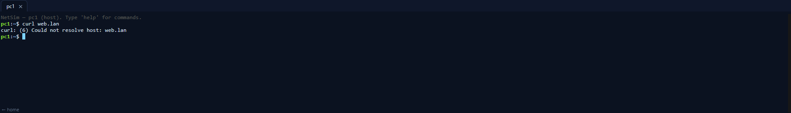
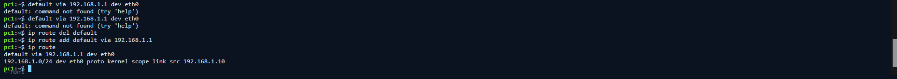
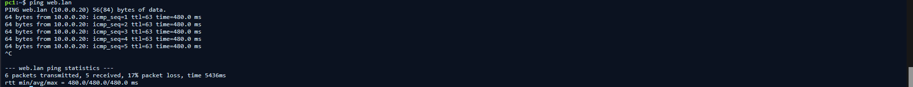
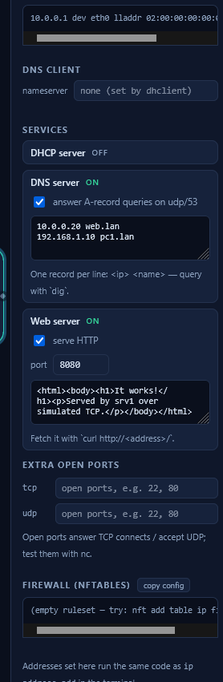

# Ticket 04 — Multiple Network and Web Service Issues

**Ticket:** INC-004  
**Priority:** High  
**Status:** Resolved  
**Lab:** NetSim (simulated IT support environment)

## Scenario

A user reported that the internal company website, `web.lan`, was unavailable even though the workstation appeared to be connected to the network.

This simulated incident intentionally contained more than one fault. The goal was to troubleshoot the issue methodically, restore connectivity, continue investigating after the first fix, and verify the original user-facing service.

> This is a simulated support scenario created for hands-on troubleshooting practice. It is not a real customer incident.

## User Report

> “The company website is unavailable. I can't access it from my workstation. It was working normally earlier.”

## Network Environment

| Device / Service | Expected Configuration |
|---|---|
| PC1 | `192.168.1.10/24` |
| Default Gateway | `192.168.1.1` |
| DNS Server | `10.0.0.20` |
| Web Server / SRV1 | `10.0.0.20` |
| Website | `web.lan` |
| Expected HTTP Port | `80` |

## Troubleshooting

### 1. Reproduced the issue

The website could not be accessed:

```bash
curl web.lan
```

The command returned:

```text
Could not resolve host: web.lan
```



A DNS query also failed:

```bash
dig web.lan
```


This showed that PC1 could not currently reach the DNS service.

### 2. Verified PC1 addressing

I checked the workstation interface:

```bash
ip addr
```

PC1 still had the expected address:

```text
192.168.1.10/24
```


This ruled out an incorrect workstation IP address as the immediate cause.

### 3. Inspected the routing configuration

I checked the routing table:

```bash
ip route
```

The default route was:

```text
default via 192.168.1.254 dev eth0
```


The expected gateway was `192.168.1.1`.

### 4. Corrected the default gateway

I removed the incorrect route and restored the correct gateway:

```bash
ip route del default
ip route add default via 192.168.1.1
ip route
```



After this change, `web.lan` resolved to `10.0.0.20` and the server responded to ping.



### 5. Continued troubleshooting after the first fix

The original website problem was tested again:

```bash
curl web.lan
```

The error changed to:

```text
Failed to connect to web.lan port 80: Connection refused
```


This was important evidence: routing and name resolution were now working, but the HTTP service was still unavailable on its expected port.

### 6. Isolated the web-service problem

Inspection of SRV1 showed that the web service was running on TCP port `8080` instead of the expected HTTP port `80`.



I tested the application directly:

```bash
curl http://web.lan:8080
```

The server returned:

```text
It works!
```


This confirmed that the application itself was operational and isolated the remaining issue to the service port configuration.

### 7. Restored expected HTTP access

The web service was returned from TCP port `8080` to TCP port `80`.

Final verification:

```bash
curl http://web.lan
```

The server successfully returned:

```text
It works!
```


## Root Cause

The incident contained two simultaneous configuration problems:

1. **Incorrect default gateway on PC1** — traffic for the remote server network was being sent to `192.168.1.254` instead of the correct router at `192.168.1.1`.
2. **Incorrect web service port on SRV1** — the web application was listening on TCP `8080` while users expected standard HTTP access on TCP `80`.

Correcting only the first issue restored network connectivity but did not fully resolve the user-facing problem. Continued verification exposed the second issue.

## Resolution

- Restored PC1's default gateway to `192.168.1.1`.
- Confirmed that DNS resolution and connectivity to `web.lan` were restored.
- Identified that the web service was listening on TCP `8080`.
- Verified the application directly on port `8080`.
- Restored the web service to TCP port `80`.
- Re-tested the original URL and confirmed successful access.

## Commands Used

```bash
curl web.lan
dig web.lan
ip addr
ip route
ping 192.168.1.1
ping web.lan
curl http://web.lan:8080
curl http://web.lan
```

## Key Takeaways

- A valid local IP address does not guarantee correct routing.
- The default gateway determines where traffic is sent when the destination is outside the local subnet.
- A successful ping confirms IP reachability but does not prove that an application service is available.
- HTTP clients use port 80 by default unless another port is explicitly specified.
- A changing error message can show that one problem was fixed while another still remains.
- Troubleshooting should continue until the original reported symptom is successfully verified.
- In production, unexpected service or port changes should be validated against documentation/change records and escalated when outside the technician's authorization.
